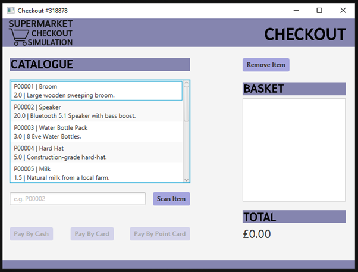
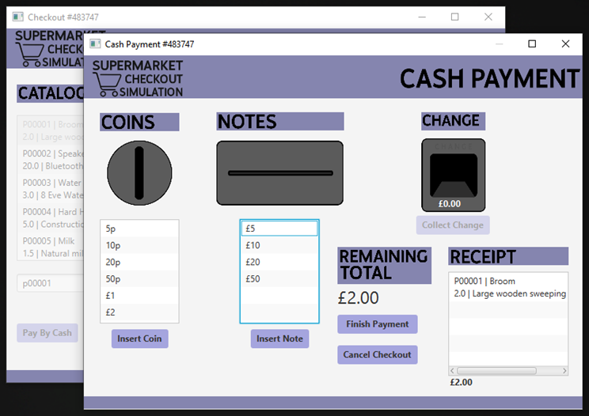
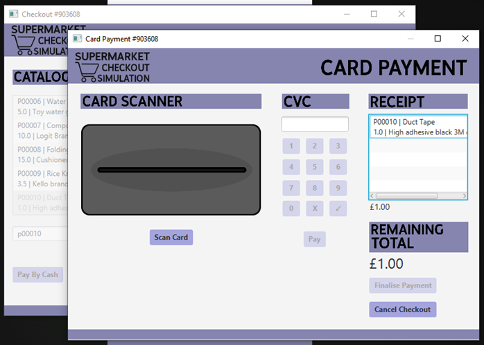
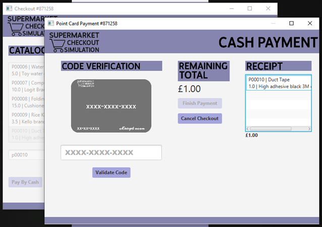
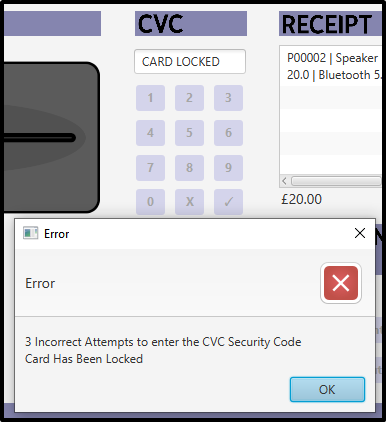
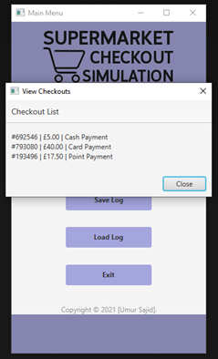
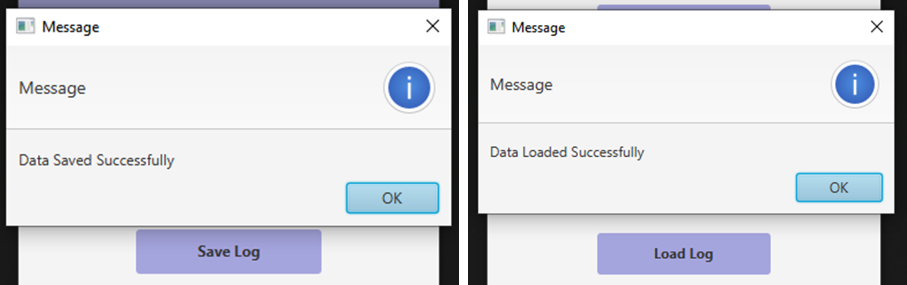

Supermarket Checkout Simulation Project
=============

Supermarket checkout simulation aims to replicate a physical supermarket checkout, through the use of interactive JavaFX menus. The user can; start a checkout, pay in 3 different ways, view existing checkouts on the system and save and load checkout logs to and from a file.

### Features
- Selection of 3 Payment Methods (Cash, Card, Points)
- Save/Load Checkout Functionality
- Ability for Multiple Concurrent Checkouts
- Comprehensive GUI including Main Menu
- Animations

## Tech Stack

Languages: Java, FXML

Software: IntelliJ IDEA, JavaFX

Required Software
-------
Java SDK 11.0.14

Open JavaFX 11.0.2

VM Options
-------
--module-path "C:/Program Files/Java/javafx-sdk-11.0.2/lib" --add-modules=javafx.controls,javafx.fxml --add-exports javafx.base/com.sun.javafx.collections=ALL-UNNAMED

## Images

#### Checkout and Payment
-------

#### Card Locked after incorrect CVC
-------

#### Checkout Log
-------

#### Save/Load Checkouts
-------

